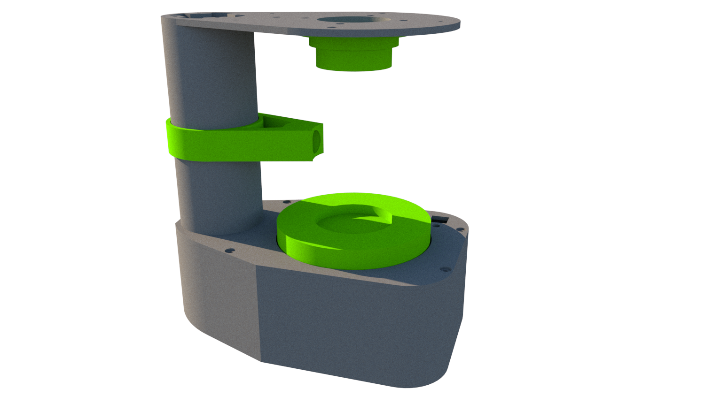
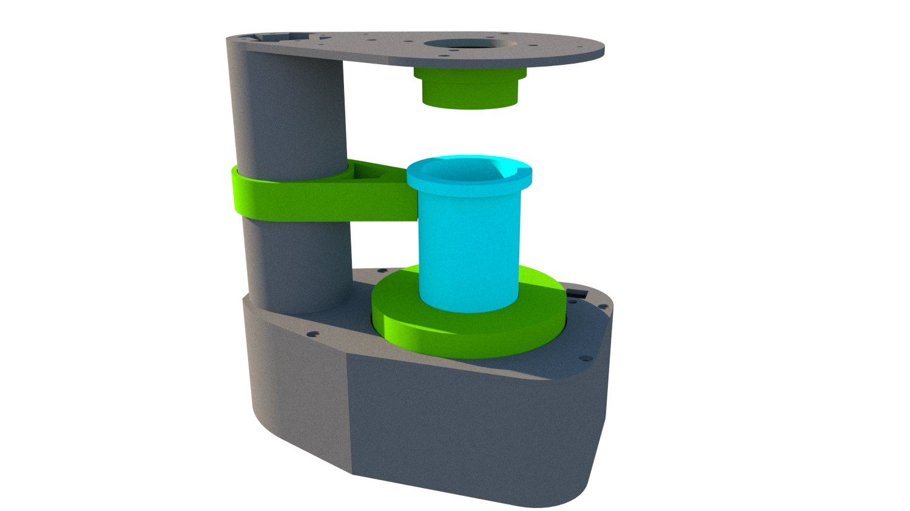
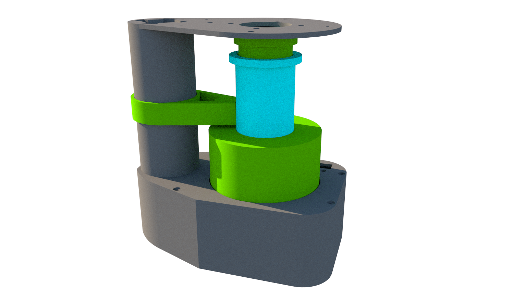
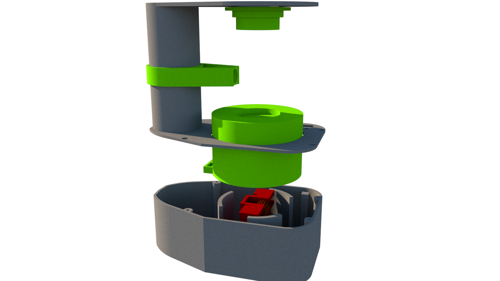

# ModeladoImpresion3D-PrototipoAlcolimetro
Diseño 3D del prototipo para la investigación de Alcohol.

# Funcionamiento

### Etapa Inicial 

### Etapa Inicial 

### Diseño 3D 

[Descargar archivo SketchUp 2019 aqui](https://raw.githubusercontent.com/johnkevin-hz/ModeladoImpresion3D-PrototipoAlcolimetro/main/doc/dise%C3%B1o3d-alcolimetro.skb)

